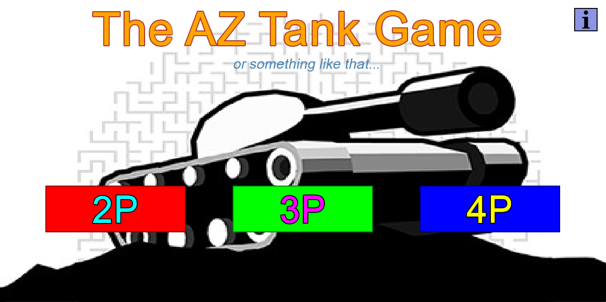
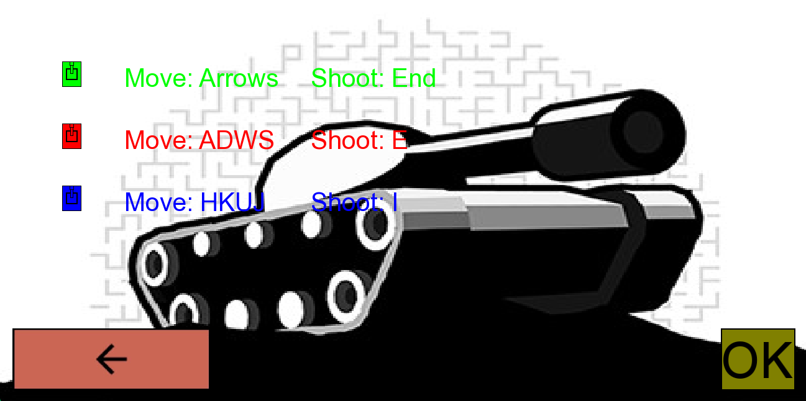
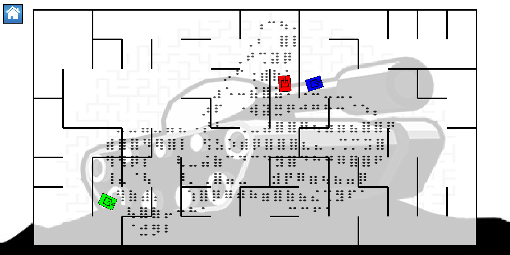

# AZ Tank game
Sinh viên: Nguyễn Nam Khánh - 24021531
### Giới thiệu game AZ (bản gốc)
Game này em làm dựa trên game AZ Tank Trouble trên nền tảng game online tuổi thơ Y8.com. \
Game khá đơn giản: có nhiều người chơi, mỗi người điều khiển xe tăng của mình di chuyển và bắn đạn phá hủy các xe còn lại. Xe nào sống sót đến cuối cùng thì thắng. \
Cái hay ho nhất của game này là những viên đạn được bắn ra sẽ nảy đập tường rất nhiều lần chứ không biến mất ngay lập tức. Điều này đòi hỏi người chơi phải có khả năng tính toán và cảm giác hình học tương đối tốt, kết hợp với kỹ năng di chuyển né đạn chính xác. \
Ngoài ra, một phần thú vị khác của game nằm ở các power-up sẽ xuất hiện ngẫu nhiên trên bản đồ theo thời gian. Hệ thống power-up cơ bản gồm có đạn tiểu liên, bom, tên lửa, laze. Tuy nhiên, vì trong game em làm em không có đủ thời gian để thêm vào phần power-up, nên em sẽ không nói chi tiết hơn về từng loại power-up nữa. \
Đây là link game gốc https://www.y8.com/games/az. Game này có khá nhiều bản trên Y8, và đây có vẻ là bản sát với trí nhớ của em nhất.
### Chi tiết game
Em đã làm menu cho game. Tại đây, có thể chọn chế độ chơi (2, 3 hoặc 4 người chơi).

Với mỗi chế độ chơi, trước khi vào game sẽ có thông tin về các phím điều khiển.

Khi mới vào game, các xe tăng sẽ được xếp ở vị trí ngẫu nhiên. Bản đồ (mà phần chính là các đoạn tường ngang dọc) cũng sẽ được sinh ra ngẫu nhiên. Các người chơi cứ điều khiển xe tăng bắn nhau, cho đến khi nào chỉ còn lại đúng một xe sống sót, hoặc là không còn xe nào còn sống nữa, thì sau khoảng vài giây sẽ chuyển sang một trận tiếp theo, với bản đồ mới và đầy đủ các xe tăng. Ngoài ra, ở góc trên trái cũng có một nút home để quay trở về menu.

Phần gameplay sẽ được nói chi tiết hơn trong video dưới đây. Video gồm có hai phần là giải thích cấu trúc code và minh họa cách chơi.
### Trích dẫn nguồn
Toàn bộ phần code là em tự viết. Thậm chí, em chủ đích dùng IDE cổ xưa DevC++ để code, nên còn không có AI completeion. Framework em dùng để code game là SFML https://www.sfml-dev.org/. SFML cũng ở cùng tầm (hay đúng thuật ngữ là cùng level of abstraction) với SDL, nhưng được cái SFML có tutorial rất chi tiết, beginner-friendly, nên em chọn SFML để tiện thể học về kiến trúc game cơ bản và các yếu tố thường gặp khi code game. \
Gần như toàn bộ phần hình ảnh là em tự vẽ. Chỉ có mỗi cái ảnh xe tăng ở background là em lấy từ ảnh của game AZ gốc [Link ảnh](https://www.1001games.com/action/az-tanks). \
Gần như toàn bộ phần âm thanh là em tự làm (thổi bằng mồm, đập tay vào bàn, ... để tạo ra tiếng xe nổ, tiếng xe bắn đạn, tiếng đạn đập tường). Tất nhiên là cái nhạc nền thì em lấy từ nguồn ngoài, là Origami theme trong Photo Slideshow của iPhone [Link nhạc (Youtube)](https://www.youtube.com/watch?v=o0I5uj7e0MU).
